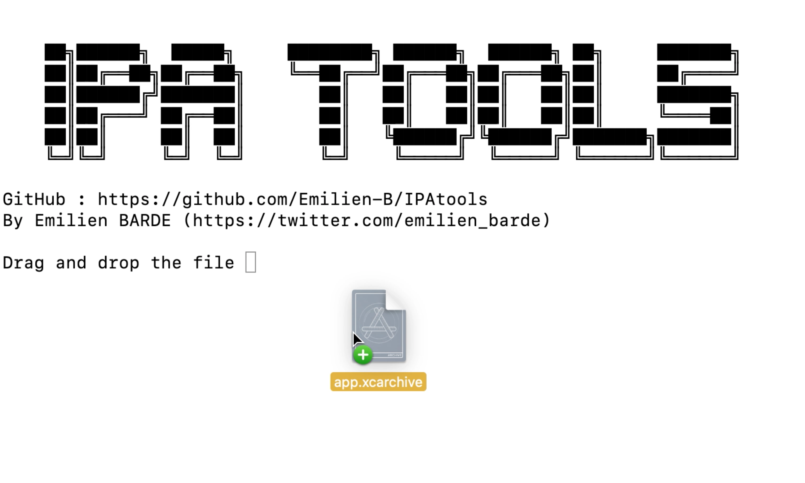
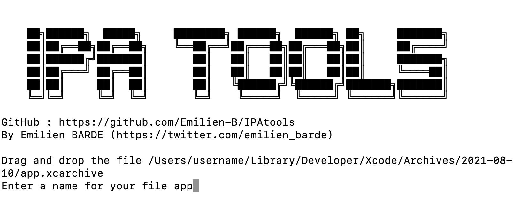
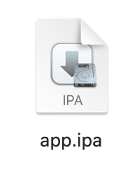
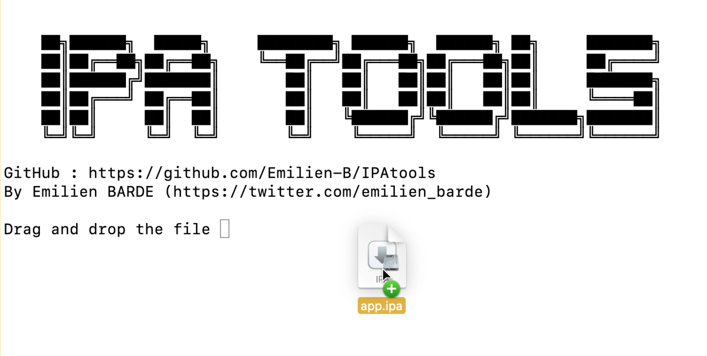

# 📖 Présentation
**IPAtools** est un petit programme python qui permet d'exporter une archive [**Xcode**](https://developer.apple.com/xcode/) en fichier .ipa (compatible iOS) rapidement.
Le programme est uniquement compatible [**MacOS**](https://apple.com/fr/macos/big-sur/)

# Utilisation
Lancer le programme dans un terminal :
```
python ipa_tools.py
```

## 📁 Exporter un .ipa
Glisser l'archive Xcode dans la fenêtre : 
</img>

Entrer un nom pour votre fichier :
</img>

Un dossier apparaitra sur votre bureau avec dedans le fichier .ipa :
</img>


## 📂 Décompresser un .ipa

Glisser le fichier .ipa
</img>

Un dossier apparaitra sur votre bureau avec dedans le fichier décompressé :
</img>

# 📎 Autres...


### 🖥 Mon compte Twitter


**[twitter.com/emilien_barde](https://twitter.com/emilien_barde)**

### 💰 Me soutenir
**[paypal.com/emilienb31](https://www.paypal.com/paypalme/emilienb31)**

### 📚 Documentation
