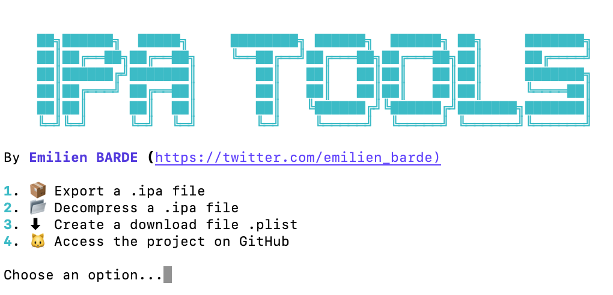

# 📖 Présentation
**IPAtools** est un petit programme python qui permet de gérér des fichier .ipa (compatible iOS) rapidement.

- Générer un fichier .ipa à partir une archive [Xcode](https://developer.apple.com/xcode/)
- Décompresser un fichier .ipa
- Créer un fichier de téléchargement .plist

</img>


# ⚙️ Utilisation
Lancer le programme dans un terminal :
```
python ipa_tools.py
```

⚠️ Le programme est uniquement compatible [**MacOS**](https://apple.com/fr/macos/).

# ⚖️ Politique d'Apple

>"Les appareils [Apple]((https://apple.com)) prennent en charge l’installation sans fil d’apps internes propriétaires sans le recours à un [Mac](https://www.apple.com/mac/) ou à l’[App Store](https://www.apple.com/app-store/). Avant de pouvoir distribuer ces apps, vous devez posséder un profil dʼapprovisionnement. [...] Dans le cas dʼune app [iOS](https://www.apple.com/ios/) ou [iPadOS](https://www.apple.com/ipados/), exportez un nouveau paquet d’app (un fichier .ipa) avec le nouveau profil d’approvisionnement pour les utilisateurs qui installent l’app pour la première fois."
>
>*[Apple](https://apple.com), 27 octobre 2021*

# 📎 Autres...


### 🖥 Mon compte Twitter


**[twitter.com/emilien_barde](https://twitter.com/emilien_barde)**

### 💰 Me soutenir
**[paypal.com/emilienb31](https://www.paypal.com/paypalme/emilienb31)**

### 📚 Documentation

**[Distribuer des apps internes propriétaires à des appareils - apple.com](https://support.apple.com/fr-ch/guide/deployment/depce7cefc4d/web)**

**[Créer une archive Xcode - docs.appeon.com](https://docs.appeon.com/pb2019/appeon_mobile_tutorials/ch04s02s03.html)**

**[Ouvrir une archive Xcode - commentouvrir.com](https://commentouvrir.com/extension/xcarchive)**

